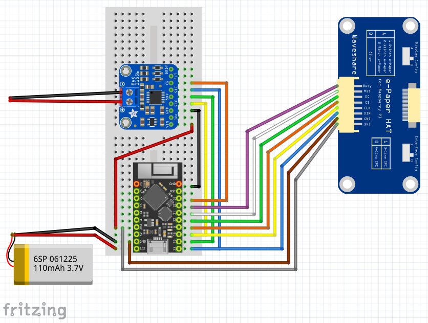
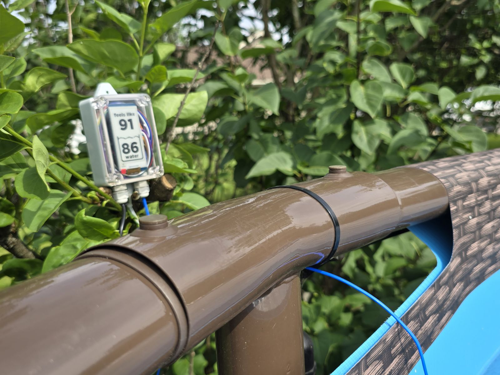

# Project Overview
I wanted to build a device that displays the outdoor "feels like" temperature of the air along with a pool's water temperature. I also wanted people to be able to check the pool temperature on a website.

I initially stored temperature data in [InfluxDB](https://hub.docker.com/_/influxdb) but transitioned to [Webis](https://hub.docker.com/r/nicolas/webdis) which allows for an HTTPS front-end to [Redis Time Series](https://hub.docker.com/r/redislabs/redistimeseries). I will eventually switch from Redis to [Valkey](https://hub.docker.com/r/valkey/valkey) when Valkey supports the [Time Series module](https://github.com/valkey-io/valkey/issues/408)).

# Parts List
- Unexpected Maker [TinyPICO](https://www.adafruit.com/product/5028) or [TinyS3](https://www.adafruit.com/product/5398)
- Adafruit [MAX31856](https://www.adafruit.com/product/3263) Universal Thermocouple Breakout
- Twidec [K-Type Thermocouple Probe](https://www.amazon.com/dp/B07PNTDFGJ)
- Waveshare [2.13" e-Paper HAT](https://www.amazon.com/dp/B071S8HT76)
- qBoxMini [Waterproof Enclosure](https://www.amazon.com/dp/B095FJ3DKS)
- [PCB Prototype Boards](https://www.amazon.com/dp/B0896YPD8F)
- [Outdoor USB Plug](https://www.amazon.com/dp/B079QDVQG9)
- [USB Pigtail Cables](https://www.amazon.com/dp/B09PN4DX8G)
- EEMB [Lithium Polymer Batter](https://www.amazon.com/dp/B09DPPCKXF)
- [JST-PH 2.0 Connectors](https://www.amazon.com/dp/B0B59PK1HW)

# Wiring Diagram

# Project Photo

