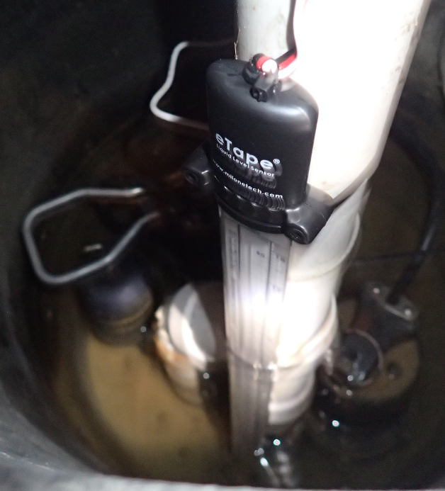

# Sending Micropython data to InfluxDB

After setting up some sensors and doing data collection with MQTT and later with custom Python Flask HTTP calls, I settled on sending the data to an InfluxDB time series database so that I could view the data in Grafana.

These scripts are my initial attempt at coming up with a way to send the sensor data in a common InfluxDB format.

